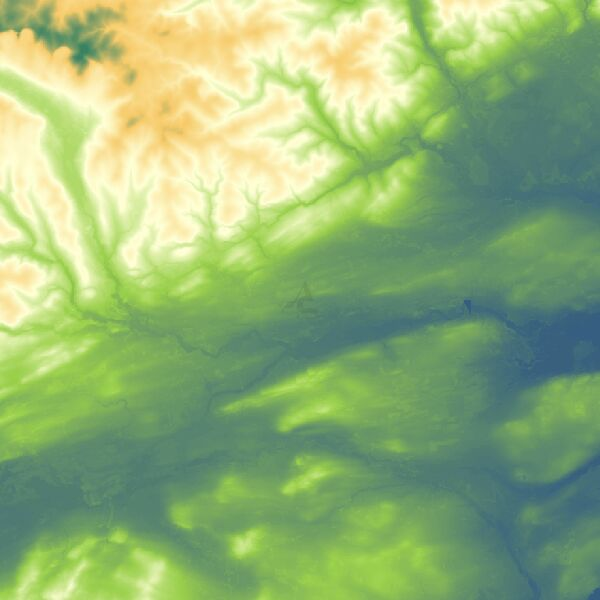
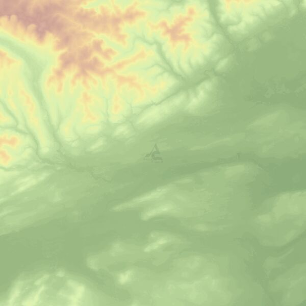
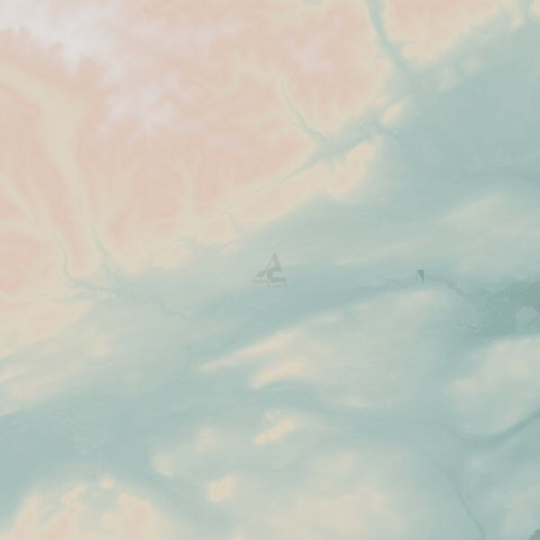

Geoserver-DEM-SLDs
==================

SLDs for elevation dataset rendered in Geoserver.

**dem.sld**: classic colour scheme for elevation data.

**dem_esri.sld**: colour scheme based on the ESRI elevation palette.

**dem_tpglhcm.sld**: colour scheme based on the cpt-city palette.

